# travel-planner

## Getting started

### 1. Environment Setup

For some services, you need to set up environment variables. Copy the `.env.example` file to `.env` and fill in the required values.

- `GENAI_API_KEY`: Your Google GenAI API key for the Travel Service.

### 2. Running the Application

To run the application locally, use Docker Compose. Install docker, then execute the following command in the root directory of the project:

```bash
docker-compose up -d
```

## System Architecture

```mermaid
graph TD
    %% Frontend
    A["🌐 Angular App"]

    %% Backend Microservices
    B1["🔐 Auth Service"]
    B2["🧳 Travel Service"]
    B3["📊 Monitoring Service and Frontend"]

    %% Databases
    D1[("🗄️ PostgreSQL (User Data)")]
    D2[("🗂️ MongoDB (Trip Data & Logs)")]

    %% External API
    E["🤖 Google GenAI API"]

    %% Connections
    A -- "RESTful API" --> B1
    A -- "RESTful API" --> B2
    B2 -- "Auth validation" --> B1
    B1 -- "User Data" <--> D1
    B2 -- "Trip data & logs" <--> D2
    D2 -- "Search logs" --> B3
    B2 -- "GenAI API" --> E
```



### Microservices

Both the Auth and Travel service are built with FastAPI and so you can find documentation and api testing at their respective `/docs` endpoints.

#### Microservice: Auth Service

This microservice provides authentication functionalities using FastAPI. It uses PostgresSQL for storing user data and JWT for token-based authentication.
When running docker compose, the service is available at http://localhost:8001.

#### Microservice: Travel Service

This microservice provides travel planning functionalities using FastAPI. It uses Google GenAI for generating travel plans and destination recommendations. It is important to set the `GENAI_API_KEY` in your `.env` file to use this service. You can get one from the [Google AI Studio](https://aistudio.google.com/u/1/apikey).
When running the service, it will be available at http://localhost:8000.
