# Travel Planner – Full Stack Application

## Getting started

### 1. Environment Setup

For some services, you need to set up environment variables. Copy the `.env.example` file to `.env` and fill in the required values.

- `GENAI_API_KEY`: Your Google GenAI API key for the Travel Service.

### 2. Running the Application

To run the application locally, use Docker Compose. Install docker, then execute the following command in the root directory of the project:

```bash
docker-compose up -d
```

## Travel Planner – Frontend

<div style="display: flex; gap: 12px; justify-content: center;">
  
  
  
  
</div>

The frontend is built with Angular and provides a user-friendly interface for interacting with the travel planning services. It allows users to log in, register, view their trips, and get destination recommendations.

When running with docker compose, the frontend is available at http://localhost:4200.

### Page Overview

- **Home Page** (`/`)  
  Redirects to the login page if not authenticated, otherwise shows the users trips.

- **Login Page** (`/login`)
  Displays a login form for users to authenticate.
- **Register Page** (`/register`)
  Displays a registration form for new users to create an account.
- **Account Page** (`/account`)
  Displays the user's account details and allows them to log out.
- **Trip View Page** (`/trip/:id`)
  Displays the details of a specific trip, including the itinerary and destination recommendations.
- **Trip Recommendation Page** (`/recommendations`)
  Form for users to input their travel preferences and receive destination recommendations. Then after picking a destination, it will generate a trip plan with the option to save it to their account.

## System Architecture

```mermaid
graph TD
    %% Frontend
    A["🌐 Angular App"]

    %% Backend Microservices
    B1["🔐 Auth Service"]
    B2["🧳 Travel Service"]
    B3["📊 Monitoring Service and Frontend"]

    %% Databases
    D1[("🗄️ PostgreSQL (User Data)")]
    D2[("🗂️ MongoDB (Trip Data & Logs)")]

    %% External API
    E["🤖 Google GenAI API"]

    %% Connections
    A -- "RESTful API" --> B1
    A -- "RESTful API" --> B2
    B2 -- "Auth validation" --> B1
    B1 -- "User Data" <--> D1
    B2 -- "Trip data & logs" <--> D2
    D2 -- "Search logs" --> B3
    B2 -- "GenAI API" --> E
```



### Microservices

Both REST APIs Auth and Travel service are built with FastAPI and so you can find documentation and api testing at their respective `/docs` endpoints.

#### Auth Service

This microservice provides authentication functionalities using FastAPI. It uses PostgresSQL for storing user data and JWT for token-based authentication.
When running docker compose, the service is available at http://localhost:8001.

#### Travel Service

This microservice provides travel planning functionalities using FastAPI. It uses Google GenAI for generating travel plans and destination recommendations. It is important to set the `GENAI_API_KEY` in your `.env` file to use this service. You can get one from the [Google AI Studio](https://aistudio.google.com/u/1/apikey).
When running the service, it will be available at http://localhost:8000.

#### Monitoring Service

The monitoring service is a simple FastAPI application that renders a dashboard template with information about the logs recorded from the travel service. It uses MongoDB to store the logs and provides a simple interface to view them. It shows the most searched destinations and the most popular trip types.
When running docker compose, it will be available at http://localhost:8080.
